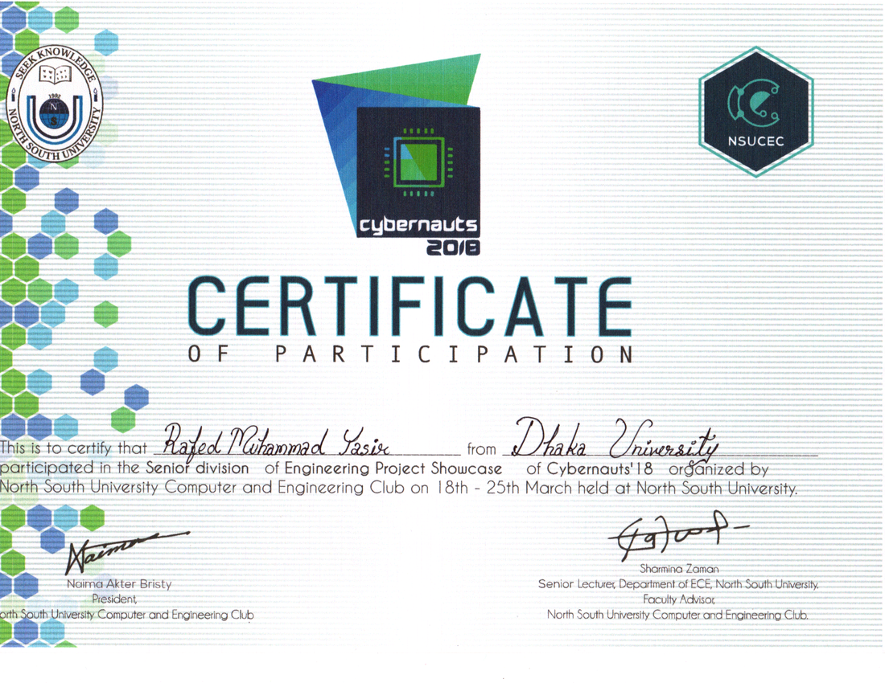

Another achievement from NSU! A bit unlucky we even had to share the position of runners up. Apart from that it was an event to enjoy!

Also got lucky to give my first tv interview ever and that too on [BBC click!](https://youtu.be/Bpd7cbYMJns?t=34)

Project: Virtual Trial Room

Team members:
* Rafed Muhammad Yasir
* Moumita Asad
* Aquib Azmain

