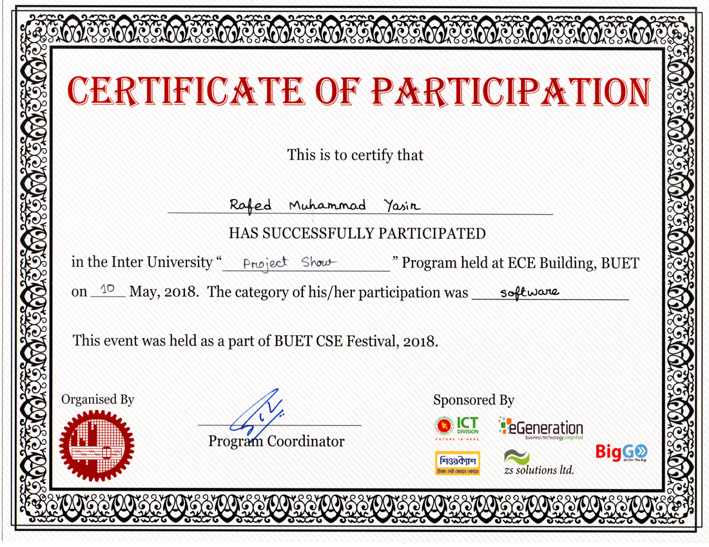

BUET CSE fest was yet another win for our virtual trial room project. Being able to take away a prize from the strong contenders of BUET is really an achievement to remember.

Project: Virtual Trial Room

Team members:
* Rafed Muhammad Yasir
* Aquib Azmain
* Moumita Asad

