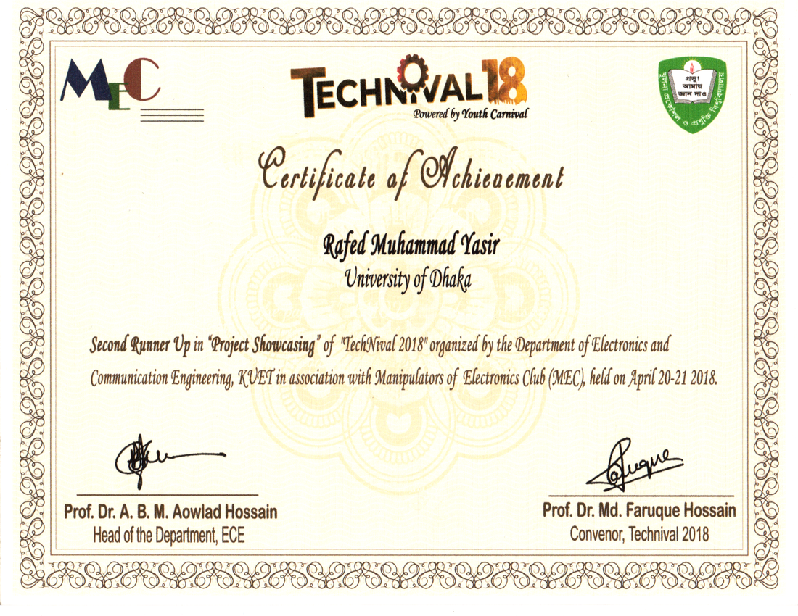

KUET technival was the biggest compeition we faced so far in terms of number of participants. It was a hard competition and we managed a 2nd runners up.

Project: Virtual Trial Room

Team members:
* Rafed Muhammad Yasir
* Moumita Asad
* Aquib Azmain

