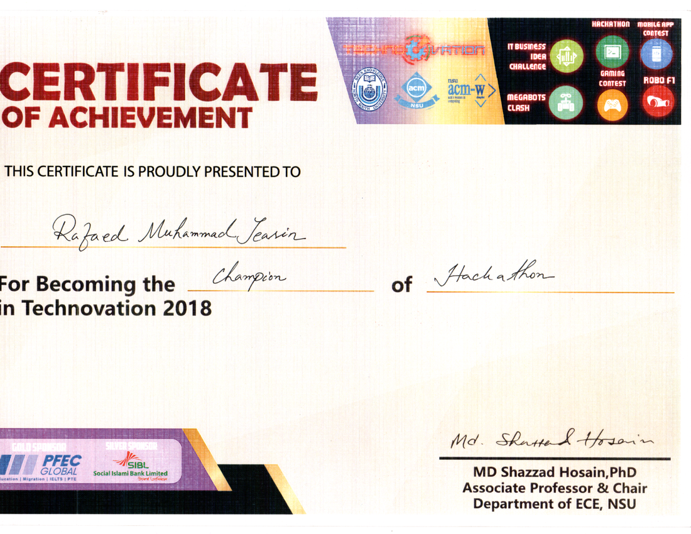

Our first ever hackathon and our first ever victory being champions. It was a moment to remember at NSU. 

Project: Virtual Trial Room

Team members:
* Rafed Muhammad Yasir
* Moumita Asad
* Shuvo Saha
* Fazle Rabbi

