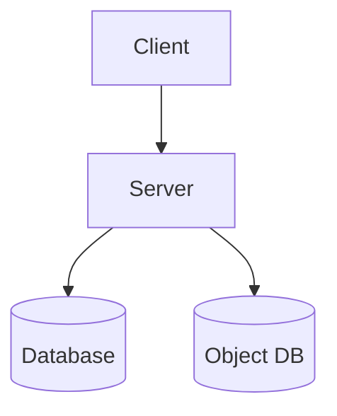
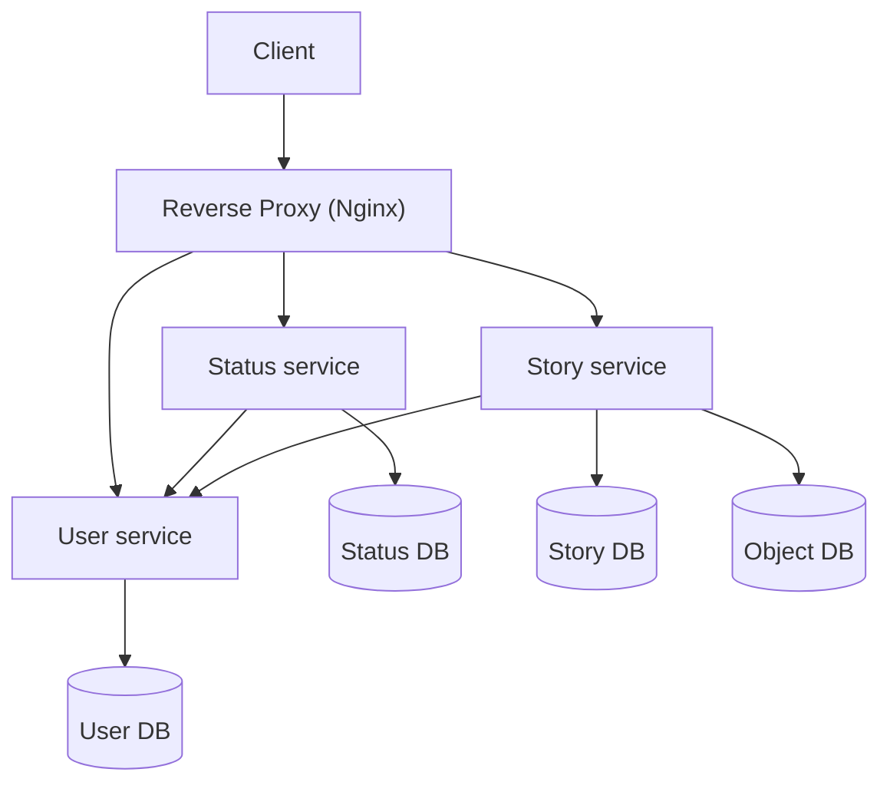

## Goal

Your task is to build a monolithic web based system. Then, break down the system into microservices following the microservice architecture. To acheive this follow the steps below.

## Step 1: Build a server and a client

You will build a rudimentary version of **Facebook**. The app itself should not be complex as we are here to build a distributed system and not a full featured social media app.

### Architecture



### Requirements

#### Client Requirements

The client UI will have three routes:
- Registration page
- Login page
- News feed page. A news feed will have
    - A horizontal list of stories at the top (images only)
    - Status from different users (texts only, no comments)

#### Server requirements

##### APIS

- **/register** endpoint for creating new users
    - user registers with email and password
- **/login** endpoint for logging (with JWT)
    - user logs in with email and password
- **/status** endpoint for creating and retrieving status
    - GET: Get latest 10 statuses of all users except logged in user
    - POST: Create new status for user
- **/story** endpoint for creating and retrieving stories
    - GET: Get latest 10 stories of all users except logged in user
    - POST: Create new story for user

##### System assumptions

- All users are friends by default
- The system needs no other services (e.g. messenger, poke, react)

#### Other instructions
- Images uploaded in stories should be stored in an object store database (MinIO)
- Frameworks/libraries can be used. However, using frameworks (like express/flask/fastapi/gin) will make the assignment easier.
- Using a framework on the frontend can be useful (angular/vue/react).
- Don't implement extra features. Because, distributing them in multiple instances could turn out to be a problem later.
- You may use any programming language. However, **Node.js or Python or Go** is recommended.

## Step 2: Service into microservices

If you have completed step 1, congratulations! By now you have learned how to-
* make APIs and call them (from a frontend)
* integrate database with an application
* use an object store database

If you have done all that, kudos! You are now ready to start building microservices (or more like breaking an app into microservices).

### Requirements

Let's recap what modules we have in our backend system so far:
* a Reg & Auth module
* a Story module
* a Status module

Currently these modules serve from a single monolith. We need to segregate them to the following services.

1. User service
    - Registration
    - Login
    - Authentication
1. Status service
1. Story service

Our system architecture will be like the following.

### Architecture



### What to do?
1. In your project folder, make sub projects. Each sub project will be a separate service.
1. Download and configure nginx so that it works as a reverse proxy for all the services
1. For nginx configuration Google is your friend. You can also follow their official docs at [docs.nginx.com](https://docs.nginx.com/nginx/admin-guide/basic-functionality/managing-configuration-files/).
1. Write additional code so that the services communicate among themselves and the business logic discussed in _step 1_ is served.
    - You may need to check requests for **authorization** when a user hits **status service** and **story service**
1. Although it's a best practice to use separate database instances for each service, we will ignore it now for simplicity. Don't worry we'll segregate the database in some later steps.


## Step 3: Containerize and orchestrate (Coming soon!)

```mermaid
%% graph TD
%% CLIENT["Client"]-->PROXY["Reverse Proxy (Nginx)"]
%% PROXY-->AUTH[Reg & Auth]
%% PROXY-->STATUS[Status]
%% PROXY-->STORY[Story]
%% AUTH-->USER_DB[(User DB)]
%% STATUS-->STATUS_DB[(Status DB)]
%% STATUS-->HS_MQ
%% HS_MQ-->HS[Hate speech <br> checker]
%% HS-->STATUS_DB
%% STORY-->STORY_DB[(Story DB)]
%% STORY-->OBJECT_DB[(Object DB)]
```