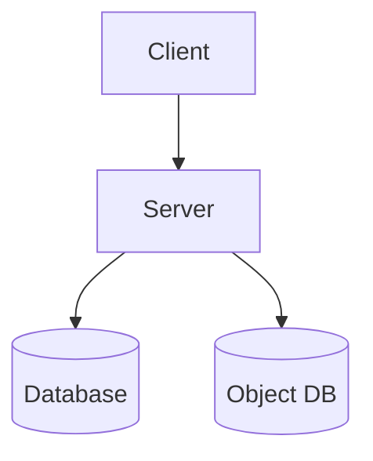

## Goal

Your task is to build a monolithic web based system. Then, break down the system into microservices following the microservice architecture. To acheive this follow the steps below.

## Step 1: Build a server and a client

You will create a basic version of **LinkedIn**. The app itself should not be complex as we are here to build a distributed system and not a full featured social media app.

### Architecture



### Requirements

#### Client Requirements

The client UI will have the following routes:
- Registration page
- Login page
- Home page: should show a vertical list of posts (texts/images)
- Notification page: should show notifications of recent posts
    - Clicking on the notification should show the post

#### Server requirements

##### APIS

- **/register** endpoint for creating new users
    - user registers with email and password
- **/login** endpoint for logging (with JWT)
    - user logs in with email and password
- **/post** endpoint for creating and retrieving posts
    - GET: Get latest posts of all users except logged in user
    - POST: Create new posts for user
- **/notification** endpoint for creating and retrieving notifications
    - GET: Get notifications
    - POST: Create notification against a post

##### Jobs

- Notification cleaner: A job should periodically check for old notifications and delete them

##### System assumptions

- All users are friends/connected by default
- The system needs no other services (e.g. chat, comments, reacts)

#### Other instructions
- Images uploaded for posts should be stored in an object store database (MinIO)
- You may use any programming language. However, **Node.js or Python or Go** is recommended.
- Frameworks/libraries can be used. However, using frameworks (like express/flask/fastapi/gin) will make the assignment easier.
- Using a framework on the frontend can be useful (angular/vue/react).
- You can use any database. Mongo recommended.
- Don't implement extra features. Because, distributing them in multiple instances could turn out to be a problem later.

## Step 2: Coming Soon!

<!--## Service into microservices

If you have completed step 1, congratulations! By now you have learned how to-
* make APIs and call them (from a frontend)
* integrate database with an application
* use an object store database

If you have done all that, kudos! You are now ready to start building microservices (or more like breaking an app into microservices).

### Requirements

Let's recap what modules we have in our backend system so far:
* a Reg & Auth module
* a Post module
* a Notification module

Currently these modules serve from a single monolith. We need to segregate them to the following services.

1. User service
    - Registration
    - Login
    - Authentication
1. Post service
1. Notification service

Our system architecture will be like the following.

### Architecture

# ```
# graph TD
# CLIENT["Client"]--><!--PROXY["Reverse Proxy (Nginx)"]
# PROXY-->USER[User service]
# PROXY-->POST[Post service]
# PROXY-->NOTIFICATION[Notification service]
# USER-->USER_DB[(User DB)]
# POST-->POST_DB[(Post DB)]
# POST-->USER
# NOTIFICATION-->NOTIFICATION_DB[(Notification DB)]
# NOTIFICATION-->OBJECT_DB[(Object DB)]
# NOTIFICATION-->USER
# ```

<!--
### What to do?
1. In your project folder, make sub projects. Each sub project will be a separate service.
1. Download and configure nginx so that it works as a reverse proxy for all the services
1. For nginx configuration Google is your friend. You can also follow their official docs at [docs.nginx.com](https://docs.nginx.com/nginx/admin-guide/basic-functionality/managing-configuration-files/).
1. Write additional code so that the services communicate among themselves and the business logic discussed in _step 1_ is served.
    - You may need to check requests for **authorization** when a user hits **post service** and **notification service**
1. Although it's a best practice to use separate database instances for each service, we will ignore it now for simplicity. Don't worry we'll segregate the database in some later steps.


## Step 3: Containerize and orchestrate

If you have completed step 2, congratulations! You have successfully created a distributed system and have a got a flavor of how microservices work!

In this step we will do three things in our app-
- **containerize** the services that we made
- use **pre built containers** for _mysql/mongo_ and _nginx_
- and **orchestrate** our services

### Self Learning

First, you will need to learn about containerization and orchestration **with docker**. You can watch the following tutorials-
- [Docker in 100 seconds](https://www.youtube.com/watch?v=Gjnup-PuquQ) 
- [Docker in 7 easy steps](https://www.youtube.com/watch?v=gAkwW2tuIqE)
- [Docker-compose tutorial](https://www.youtube.com/watch?v=MVIcrmeV_6c)
- And please, Google some stuff yourself

Once you understand the fundamentals, you can refer to [this manual](https://rafed.github.io/devra/posts/docker/useful-docker-commands/) to run the most commonly used docker commands.

<!-- Additionally, check out [this repo](https://github.com/rafed/nginx-flask-docker) for a demo web app that's load balanced, containerized and orchestrated with docker. -->
<!--
### What to do?
1. **Write a Dockerfile** for each of the services in their respective directories
    * User service
    * Post service
    * Notification service
1. **Write a docker-compose.yml** file in the root project folder to orchestrate all of the services
1. **Use separate database** (containers) for each service

_N.B Follow the reference architecture in step 2_

#### Other instructions
1. No change in the application code is necessary (Except for maybe port numbers. You may want to reassign them).
1. Windows cannot handle docker containers properly (even though Docker claims that they have support for windows). Use a Linux environment to run docker containers.

## Step 4: Deploy in a swarm

Great job guys! By now if you have successfully created a distributed system. However, the current system is distributed in software. What if we want to distribute our services in hardware?

In this step we will distribute our services in hardware. We will create a cluster of computers at first (called a swarm). Then we will deploy our containers in it.

This step by far should be the easiest (if you have done everything in the previous steps properly).

### Self Learning

Go through the following tutorials at first:
* The [official docker swarm docs](https://docs.docker.com/engine/swarm/swarm-tutorial/) have a very good getting started tutorial. Go through it.
* Watch this video [www.youtube.com/watch?v=Tm0Q5zr3FL4](https://www.youtube.com/watch?v=Tm0Q5zr3FL4)
* And please google some stuff yourself.

### What to do?
* Create a team of two/three members (max three members per team)
* Create a docker swarm with two/three PCs
* Deploy each member's facebook app in the swarm

### Important commands when creating a swarm

```bash
$ docker create swarm 
$ docker join swarm --token SWMTKN-1-26hm.....jxjxnj 192.168.x.xxx:2377
$ docker swarm leave --force

$ docker node ls
$ docker info # check current swarm status

$ docker stack deploy --compose-file docker-compose.yml bsse07xx
$ docker stack services bsse07xx
``` 
-->