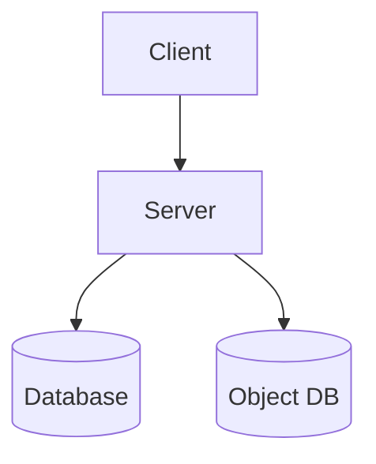
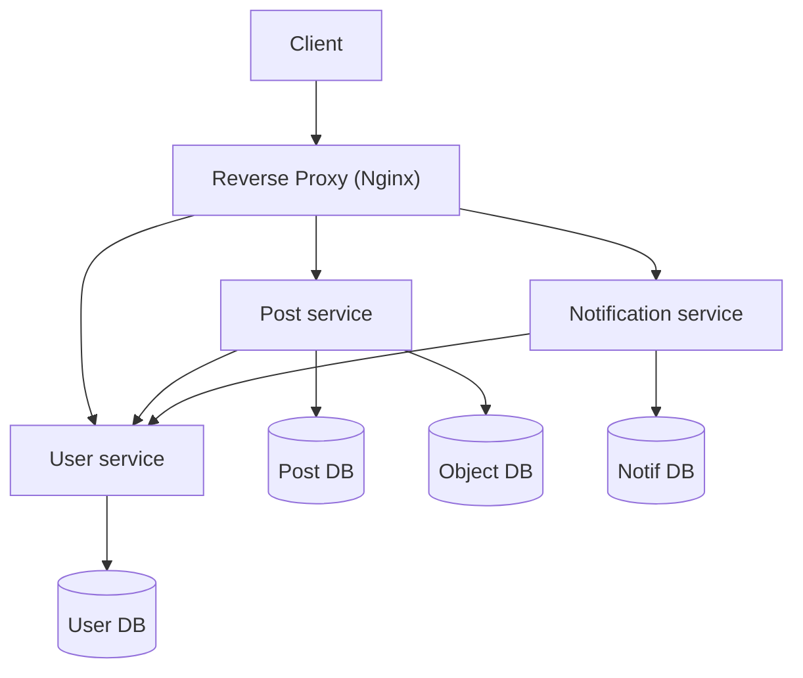

## Goal

Your task is to build a monolithic web based system. Then, break down the system into microservices following the microservice architecture. To acheive this follow the steps below.

## Step 1: Build a server and a client

You will create a basic version of **LinkedIn**. The app itself should not be complex as we are here to build a distributed system and not a full featured social media app.

### Architecture

### Requirements

#### Client Requirements

The client UI will have the following routes:
- Registration page
- Login page
- Home page: should show a vertical list of posts (texts/images)
- Notification page: should show notifications of recent posts
    - Clicking on the notification should show the post

#### Server requirements

##### APIS

- **/register** endpoint for creating new users
    - user registers with email and password
- **/login** endpoint for logging (with JWT)
    - user logs in with email and password
- **/post** endpoint for creating and retrieving posts
    - GET: Get latest posts of all users except logged in user
    - POST: Create new posts for user
- **/notification** endpoint for creating and retrieving notifications
    - GET: Get notifications
    - POST: Create notification against a post

##### Jobs

- Notification cleaner: A job should periodically check for old notifications and delete them

##### System assumptions

- All users are friends/connected by default
- The system needs no other services (e.g. chat, comments, reacts)

#### Other instructions
- Images uploaded for posts should be stored in an object store database (MinIO)
- You may use any programming language. However, **Node.js or Python or Go** is recommended.
- Frameworks/libraries can be used. However, using frameworks (like express/flask/fastapi/gin) will make the assignment easier.
- Using a framework on the frontend can be useful (angular/vue/react).
- You can use any database. Mongo recommended.
- Don't implement extra features. Because, distributing them in multiple instances could turn out to be a problem later.

## Step 2: Decompose to microservices, containerize and orchestrate

If you have completed step 1, congratulations! By now you have learned how to-
* make APIs and call them (from a frontend)
* integrate database with an application
* use an object store database

If you have done all that, kudos! You are now ready to start building microservices (or more like breaking an app into microservices).

### Requirements

Currently our application is a monolith. It's time we convert it to a microservice applitcation.

Let's recap what modules we have in our backend system so far:
* User management module (Registration, Login)
* Posts module
* Notification module

Currently these modules form a single monolith. We need to segregate them to the following services.

1. User service
    - Registration
    - Login
    - Authentication
1. Posts service
1. Notification service

In addition, we also need to develop a sustainable system/environment where we can build/run the microservices easily.

Our expected system architecture will be like the following.

### Architecture

### What to do?
1. In your project folder, make sub projects. Each sub project will be a separate microservice.
1. Decompose the monolith into microservices so that each microservice is in a sub-project.
1. Containerize each service using Docker
1. Orchestrate the services by writing a docker-compose file
1. Make sure to have an nginx container so that ALL traffic is routed through nginx and delivered to the respective services
1. Write additional code so that the services communicate among themselves and the business logic discussed in _step 1_ is served.
    - You may need to check requests for **authorization** when a user hits **post service** and **notification service**

### Suggestions/Learning Materials
1. Take your time to do the assignment. Instead of seeing it as one large task, try completing it taking one step at a time. 
1. For writing nginx configurations Google is your friend. You can also follow their official docs at [docs.nginx.com](https://docs.nginx.com/nginx/admin-guide/basic-functionality/managing-configuration-files/).
1. Easy tutorials on containerizing with Docker
    - [Docker in 100 seconds](https://www.youtube.com/watch?v=Gjnup-PuquQ) 
    - [Docker in 7 easy steps](https://www.youtube.com/watch?v=gAkwW2tuIqE)
    - [Docker-compose tutorial](https://www.youtube.com/watch?v=MVIcrmeV_6c)
    - [My personal docker cheatsheet](https://rafed.github.io/devra/posts/docker/useful-docker-commands/)
    - And please, Google some stuff yourself
1. For inspiration, you can check out [this repo](https://github.com/rafed/nginx-flask-docker) for a demo web app that's load balanced, containerized and orchestrated with docker.

Good Luck!