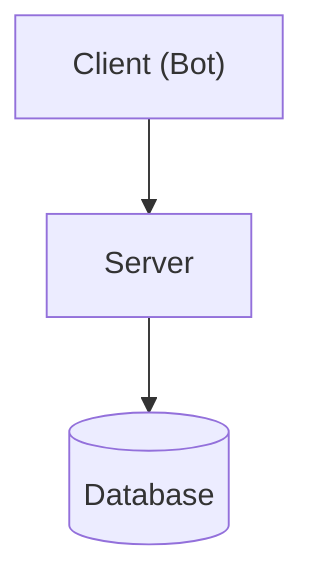
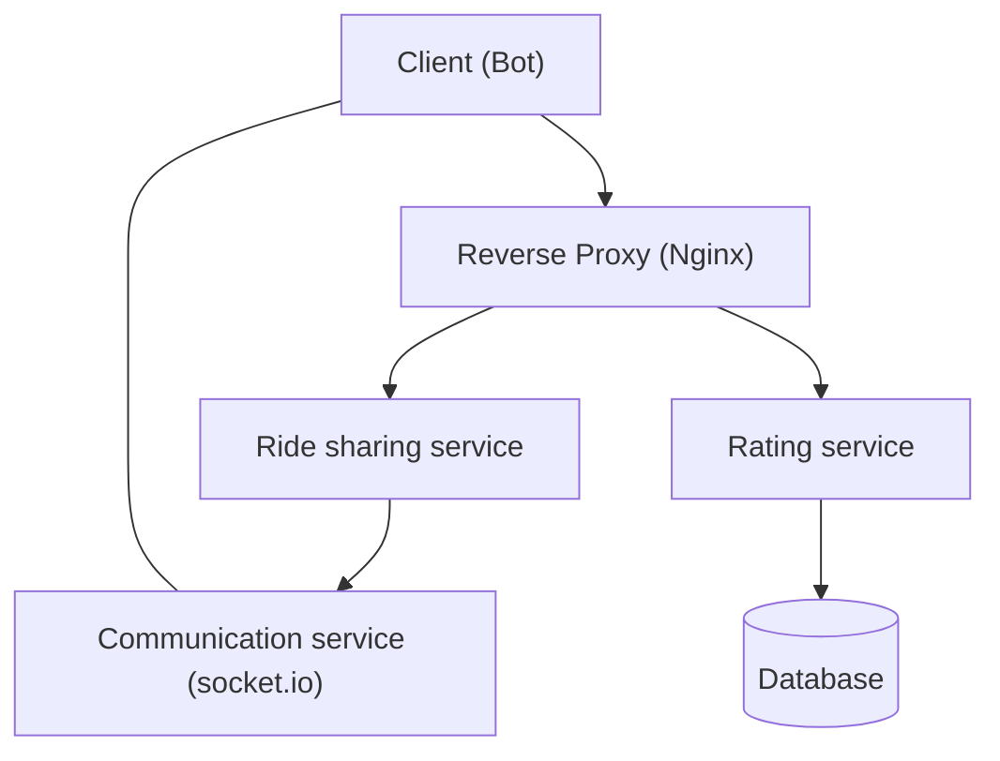
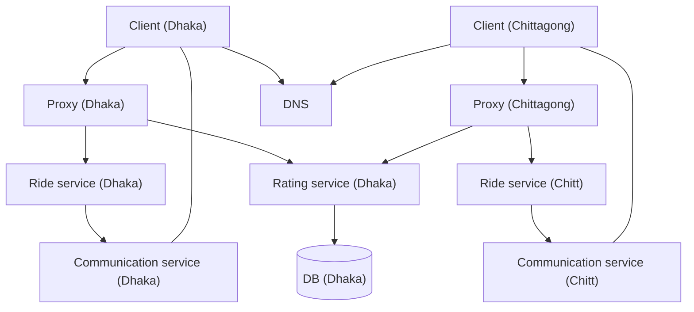

## Goal

Your task is to build a distributed web system following the microservice architecture. It should be implemented following the steps below.

## Step 1: Build a simple server (and a client)

You will build a rudimentary version of a **Ride sharing app** (like Uber/Pathao). The app itself will not be complex as we are here to build a distributed system and not a full-fledged app.

### Architecture

### Requirements

#### Client bot

The client bot will **spam the server every second** with the following two http requests:
- Rider's request contains: 
    - Name
    - Rider's Coordinates (x, y) [Random]
    - Rider's Destination (x, y) [Random]
- Driver's request contains:
    - Name
    - Car number
    - Driver's Coordinates [Random]

#### Server requirements

- **/rider** endpoint accepts rider requests (http)
- **/driver** endpoint accepts driver requests (http)
- The server will store the information **in memory** for **at least 5 seconds**. Design a function that will periodically run on the cached information and make pairs (rider, driver) based on their shortest linear distance.
- Open a **socket.io** bidirectional communication medium and send messages through the **/communication** namespace. Messages from the server will be sent to the client through this channel.
- Send the ride fare to the client (linear distance * 2 taka) (through socket.io)
- **/rating** endpoint receives a random rating after the bot receives a fare

#### Database
- The database only stores driver ratings
- Storing other information is not necessary (yet)
- Use mysql or mongodb as your database

#### Other instructions
- You may use any programming language. However, **Node.js or Python or Go** is recommended
- Frameworks/libraries can be used. However, it's best not to use full-fledged frameworks. Simpler frameworks (like express/flask/gin) will make things easier
- Don't implement extra features. Because later, distributing them in multiple instances could turn out to be a problem

## Step 2: Service into microservices

If you have completed step 1, congratulations! By now you have learned how to-
* make APIs and call them
* make sockets for bidirectional communication
* make schedulers that call a function periodically
* integrate database with an application

If you have done all that, kudos to you! You are now ready to start building microservices (or more like breaking an app into microservices).

### Requirements

Let's recap what modules we have in our backend system so far:
* a rider module
* a driver module
* a rider/driver matching module
* a rating module connecting to a database
* a communication module for bidirectional communication

We'll convert these modules to make three business services.
1. Ride sharing service
    - rider module
    - driver module
    - rider/driver matching module
1. Communication service
1. Rating service

Our system architecture will be like the following.

### Architecture

### What to do?
1. In your project folder, make sub projects. Each sub project will be a separate service.
1. Download and configure nginx so that it works as a reverse proxy for all http services (in our case **ride sharing service**  and **rating service**).
1. For nginx configuration Google is your friend. You can also follow their official docs at [docs.nginx.com](https://docs.nginx.com/nginx/admin-guide/basic-functionality/managing-configuration-files/).
1. Write additional code so that the services communicate among themselves and the business logic discussed in _step 1_ is served.

## Step 3: Containerize and orchestrate

If you have completed step 2, congratulations! You have successfully created a distributed system and have a gotten a flavor of how microservices work!

In this step we will do three things in our app-
- **containerize** the services that we made
- use **pre built containers** for _mysql/mongo_ and _nginx_
- orchestrate our services

### Self Learning

First, you will need to do learn about containerization and orchestration **with docker**. You can watch the following tutorials-
- [Docker in 100 seconds](https://www.youtube.com/watch?v=Gjnup-PuquQ) 
- [Docker in 7 easy steps](https://www.youtube.com/watch?v=gAkwW2tuIqE)
- [Docker-compose tutorial](https://www.youtube.com/watch?v=MVIcrmeV_6c)
- And please, Google some stuff yourself

Once you understand the fundamentals, you can refer to [this manual](https://rafed.github.io/devra/posts/docker/useful-docker-commands/) to run the most commonly used docker commands.

Additionally check out [this repo](https://github.com/rafed/nginx-flask-docker) for a demo web app that's load balanced, containerized and orchestrated with docker.

### What to do?
1. **Write a Dockerfile** for each of the following service in their respective sub-project folder
    - ride sharing service
    - rating servie
    - communication service
1. Write a docker-compose.yml file in the root project folder to orchestrate all of the services

#### Other instructions
1. No change in the application code is necessary (Except maybe port numbers. You may want to reassign them).
1. Windows cannot handle docker containers properly (even though Docker claims that they have support for windows). Use a Linux environment to run docker containers.

## Step 4: Geo distribute the app

Our ride sharing app is becoming popular! We now want to go global!

### Architecture

## Step 5: More development (Bonus)

#### Step 5.1: Use an in memory database

Our app has a big problem. The rider and driver list is stored in an array in memory. Imagine what will happen if we wanted to increase availability by creating multiple instances of the "Ride sharing service". Can you figure out the problem?

To solve this, instead of storing the data in memory, store it inside a redis container. The rider/driver matcher should pull data from the redis cache. (You may need to separate the rider/driver pair matcher to a separate service).

#### Step 5.2: Send emails with message queueing

We need to do email marketing to our customers to let them know about our latest upgrades and features. Do this by:

1. Install a rabbitmq container (rabbitmq is a message queue broker)
2. Make a email service that has
    - a push to broker function to push addresses to the broker
    - a "send email function" that periodically sends emails to the addresses stored in the message broker