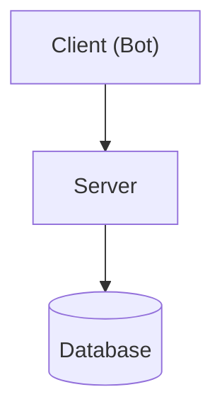
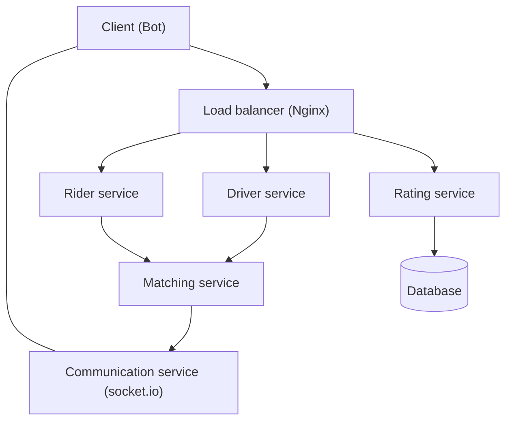

## Goal

Your task is to build a distributed web system following the microservice architecture. It should be implemented following the steps below.

## Step 1: Build a simple server (and a client)

You will build a rudimentary version of a **Ride sharing app** (like Uber/Pathao). The app itself will not be complex as we are here to build a distributed system and not a full fledged app.

### Architecture

### Requirements

#### Client bot

The client bot will **spam the server every second** with the following two http requests:
- Rider's request contains: 
    - Name
    - Rider's Coordinates (x, y) [Random]
    - Rider's Destination (x, y) [Random]
- Driver's request contains:
    - Name
    - Car number
    - Driver's Coordinates [Random]

#### Server requirements

- **/rider** endpoint accepts rider requests (http)
- **/driver** endpoint accepts driver requests (http)
- The server will store the information **in memory** for **at least 5 seconds**. Design a function that will periodically run on the cached information and make pairs (rider, driver) based on their shortest linear distance (and print it).
- **/communication** endpoint will be a bidirectional communication medium (socket.io/websocket). All messages from the server will be sent to the client through this
- Send the ride fare to the client (linear distance * 2 taka) (through websocket)
- **/rating** endpoint receives a random rating after the bot receives a fare

#### Database

- The database only stores driver ratings
- Storing other information is not necessary (yet)

#### Other instructions
- You may use any programming language. However **Node.js or Python** is recommended.
- Frameworks may be used, but it's best not to use full frameworks. Simpler frameworks (like flask/express) will make things easier
- Don't implement extra features. Because later, distributing them in multiple instances could turn out to be a problem

## Step 2: Service into microservices

If you have completed step 1, congratulations! By now you have learned how to-
* make APIs and call them
* make sockets for bidirectional communication
* make schedulers that call a function periodically
* integrate database with an application

If yoo have done all that, kudos to you! You are now ready to start building microservices (or more like breaking an app into microservices).

Let's recap what modules we have in our backend system so far:
* a rider module
* a driver module
* a rider/driver matching module
* a rating module connecting to a database
* a communication module for bidirectional communication

We'll make each of these a separate microservice. Our system architecture will be like the following.

### Architecture

## Step 3: Containerize and orchestrate

## Step 4: Geo distribute the app
