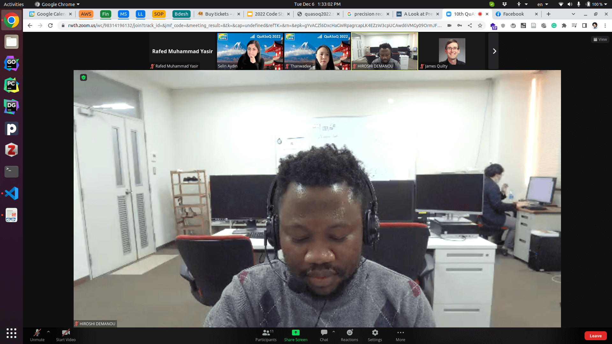
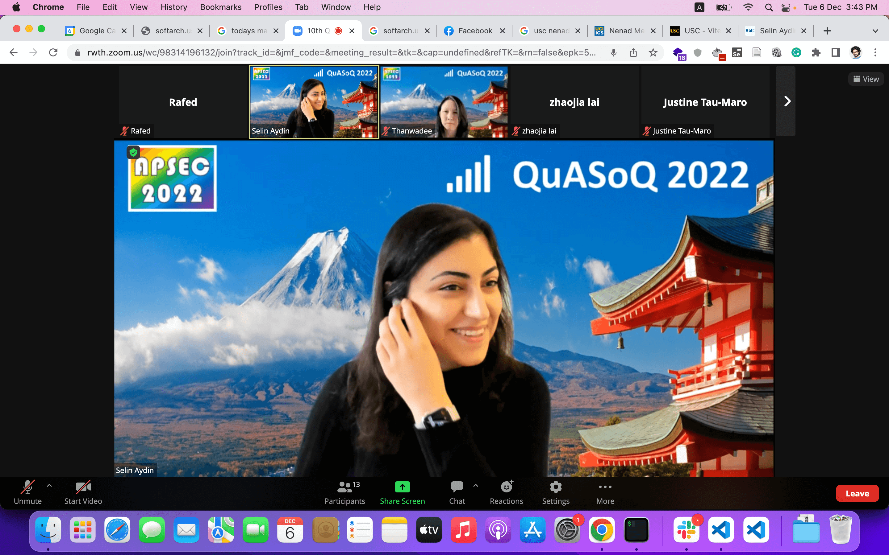



<!-- {}
Click on the **Slides** button above to view the built-in slides feature.
{}

Slides can be added in a few ways:

- **Create** slides using Wowchemy's [*Slides*](https://wowchemy.com/docs/managing-content/#create-slides) feature and link using `slides` parameter in the front matter of the talk file
- **Upload** an existing slide deck to `static/` and link using `url_slides` parameter in the front matter of the talk file
- **Embed** your slides (e.g. Google Slides) or presentation video on this page using [shortcodes](https://wowchemy.com/docs/writing-markdown-latex/).

Further event details, including [page elements](https://wowchemy.com/docs/writing-markdown-latex/) such as image galleries, can be added to the body of this page. -->

