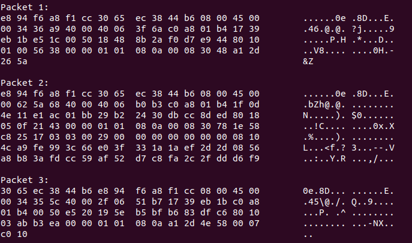

Hostman is a CLI tool that can parse PCAP files and show the details of packets traversing through a network. The project is completely written in C. No libraries were used.

It is my first software project ever. It was done as a requirement for the sotware project lab-1 (SPL-1) course.

