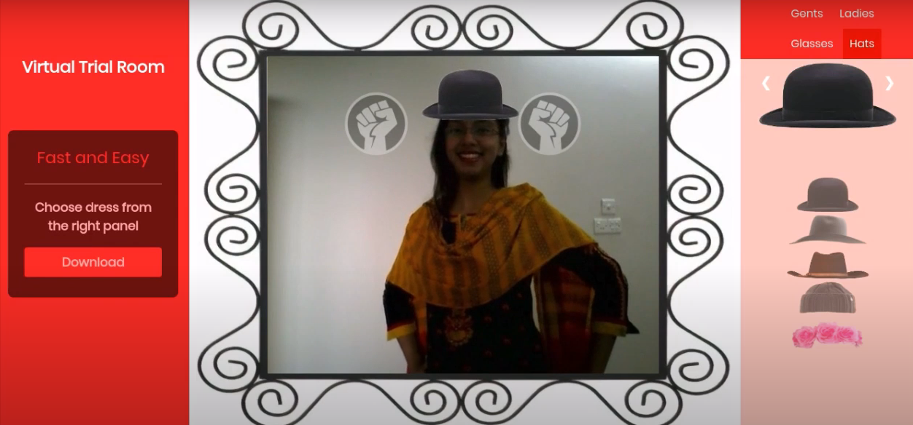

Virtual Trial Room is one of my most successful projects. It is a browser based trial room for wearing clothes virtually. 

This project won several awards- 

1. Champions, NSU Technovation Hackathon 2018, North South University
1. Joint Runners Up, NSU Cybernauts, North South University Computer & Engineering Club (NSU CEC) 
1. Second Runners Up, Technival 2018, Khulna University of Engineering and Technology (KUET)
1. Second Runners Up, Inter University Project Show, CSE Fest, Bangladesh University of Engineering and Technology (BUET)

This project also got featured on [BBC Click](https://youtu.be/Bpd7cbYMJns?t=34).

My talented friends who contributed to this project are:
- Moumita Asad
- Aquib Azmain

Technology used:
- Python
- Flask
- OpenCV